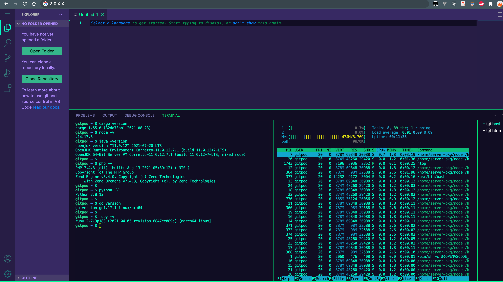

# OpenVSCode Server for Graviton2 (arm64)

## What is this?
This CDK app will deploy the arm64 port of [OpenVSCode server](https://github.com/gitpod-io/openvscode-server) on a AWS Graviton2 instance.
This brings a powerful developer IDE to your browser, with multiple development environment (go, python, node, rust, java, php, ruby...) ready to build port your application to arm64.



```bash
npm i
npx cdk deploy VscodeSpotyArmyStack
```
Note: The underlying node is a Spot EC2 instance with Bottlerocket.

Access your vscode IDE remotely via`http://<instance IP>` - 
please lock down to your client IP address (line 39), so not to expose your vscode to the whole world!

### Paranoid mode
Instead of opening up tcp/80, you can use AWS SSM portforwarding to your localhost, since bottlerocket registers itself to AWS Systems Manager Fleet!
(uncomment line 39 since you do not need any port exposed)

```bash
aws ssm start-session --target "Your Instance ID" --document-name AWS-StartPortForwardingSession --parameters "portNumber"=["80"],"localPortNumber"=["8080"]

```
Now, access your vscode at `http://localhost:8080`

# Todo
- add password auth to protect the IDE 
- CI with codebuild 
- get persistence storage
- health check
